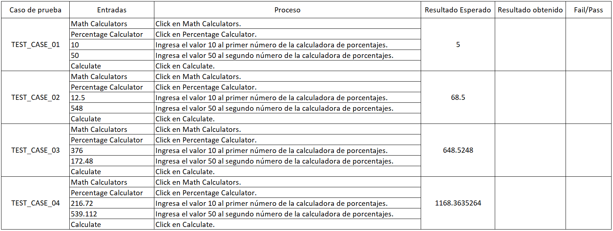
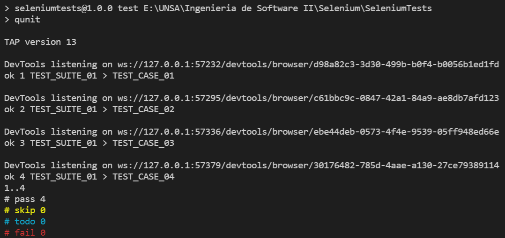

# Ingeniería de Software II - Práctica 5: Pruebas Funcionales

**Objetivo:** Automatizar pruebas funcionales de aplicaciones web utilizando Selenium Web Driver https://www.selenium.dev/

## Pre-Requisitos
- Node.js y npm
- Visual Studio Code
- Selenium Web Driver
- ChromeDriver

## Actividades
1. Implementar Casos de prueba para la funcionalidad "Percentage Calculator" (https://www.calculator.net/percent-calculator.html). Basarse en https://www.tutorialspoint.com/selenium/selenium_webdriver.htm

	- Diseñar casos de prueba: Entradas, proceso, Resultado Esperado
	

	- Implementar los scripts de prueba.
	```js
	// percentageOf.js

	const { Builder, By } = require('selenium-webdriver');

	async function percentageOf(a, b) {
		let driver = await new Builder().forBrowser('chrome').build();

		// Puts an Implicit wait, Will wait for 10 seconds before throwing exception
		driver.manage().setTimeouts( { implicit: 10000 } );

		// Launch website
		await driver.get('https://www.calculator.net/percent-calculator.html');
	
		// Maximize the browser
		await driver.manage().window().maximize();

		// Click on Math Calculators
		await driver.findElement(By.xpath('//*[@id="octitle"]/a')).click();

		// Click on Percent Calculators
		await driver.findElement(By.xpath('//*[@id="content"]/table[2]/tbody/tr/td/div[3]/a')).click();

		// Enter value of the first number of the percent Calculator
		await driver.findElement(By.xpath('//*[@id="cpar1"]')).sendKeys(a);

		// Enter value of the second number of the percent Calculator
		await driver.findElement(By.xpath('//*[@id="cpar2"]')).sendKeys(b);

		// Click Calculate Button
		await driver.findElement(By.xpath('//*[@id="content"]/table[1]/tbody/tr[2]/td/input[2]')).click();

		// Get the Result Text based on its xpath
		let result = await driver.findElement(By.xpath('//*[@id="content"]/p[2]/font/b')).getText();

		// Close the Browser.
		await driver.close();

		// Return the value of the Result
		return result;
	}

	module.exports = percentageOf;
	```
	- Ejecutar los scripts de prueba
	

	- Reportar los resultados de la ejecución
	

2. Configurar Browser-specific WebDriver
	- Dirigirse a https://chromedriver.storage.googleapis.com/index.html para descargar ChromeDriver. Se selecciona la versión correspondiente a la del navegador:
	
	
	

	- Descomprimir el zip en una carpeta y agregar el directorio a la variable de entorno `PATH`

3. Integrar xUnit
	- Instalando **QUnit**, un framework de pruebas unitarias basado en xUnit:
		> `npm install --save-dev qunit`

	- La implementación de los casos de prueba sería la siguiente
	```js
	// test/percentageOf.js

	const percentageOf = require('../percentageOf.js');

	const { test } = QUnit;

	QUnit.module('TEST_SUITE_01');

	test('TEST_CASE_01', async assert => {
		assert.equal(await percentageOf('10', '50'), '5');
	});

	test('TEST_CASE_02', async assert => {
		assert.equal(await percentageOf('12.5', '548'), '68.5');
	});

	test('TEST_CASE_03', async assert => {
		assert.equal(await percentageOf('376', '172.48'), '648.5248');
	});

	test('TEST_CASE_04', async assert => {
		assert.equal(await percentageOf('216.72', '539.112'), '1168.3635264');
	});	
	```

	- Reporte final (en consola) con resultados de los casos de prueba implementados:
	
